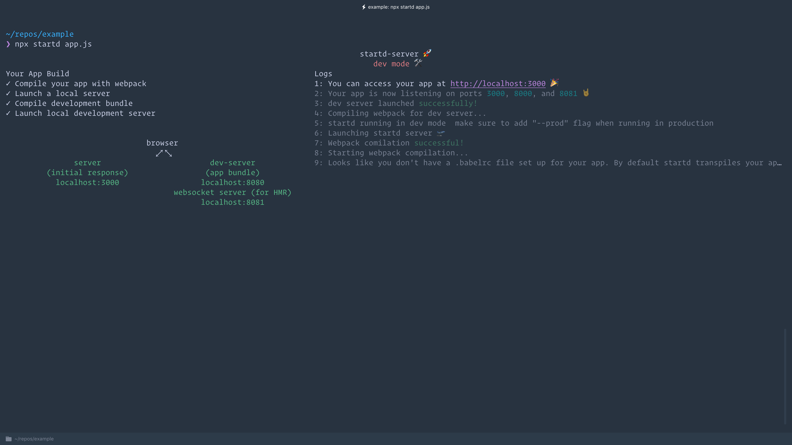

# startd 🚀

👋

startd is a [toolbox](https://youtu.be/G39lKaONAlA?t=1398) 🛠📦 to help you get your new react web app up and running fast

**Going from react component to fully functioning web app should be as easy as installing a local dependency**

## Getting started

_note: startd uses webpack+babel to compile your app. By default it will use the [react babel preset](https://babeljs.io/docs/plugins/preset-react/), but if you want to add other transpile options you can create a .babelrc file in your app directory_

```bash
npm install --save startd-server
npx startd app.js
```



### Production Usage

```bash
NODE_ENV=production npx startd app.js
node server.bundle.js
```

In production mode, startd will run once and bundle all of your assets into separate server and client bundles. Then to launch your production server, you can just run the `server.bundle.js` file.

### How it works

_The core pieces of startd are <100 lines of code. If you want to really know how your application works, go take a look!_

🔎 [server](https://github.com/mgrip/startd/blob/master/src/server.tsx) | [client](https://github.com/mgrip/startd/blob/master/src/client.tsx)

Under the hood, startd uses [koa](https://github.com/koajs/koa) to launch a new server, and just renders your react component specified by the `--path` parameter as the root level component. It uses the concept of [universal javascript](https://cdb.reacttraining.com/universal-javascript-4761051b7ae9) to ensure your app rendered on the initial server response is the same as the code sent to the client. It uses webpack+babel to compile your application.

When running in development mode, startd additionally launches another server to dynamically serve any changed assets, that update as soon as you save a change to any file referenced from your app. This is driven by [webpack-dev-middleware](https://github.com/webpack/webpack-dev-middleware) which serves the assets, and [webpack-hot-client](https://github.com/webpack-contrib/webpack-hot-client) which sends updates to your browser as files change.

#

Contributions welcome!

### 👨‍🎤👩‍🔬👨‍🎨

#
